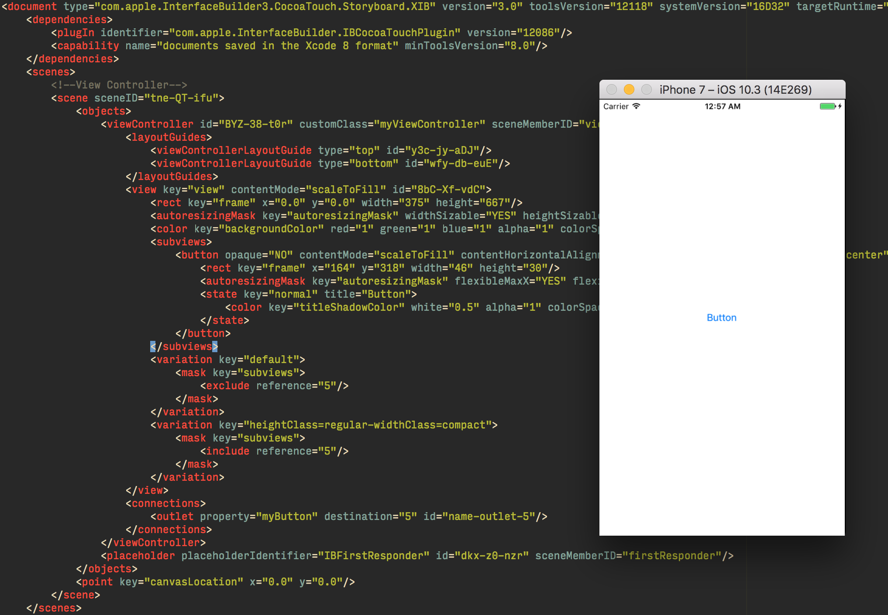
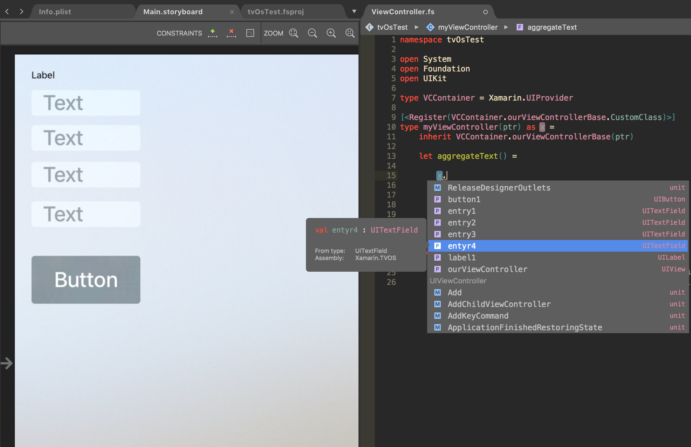
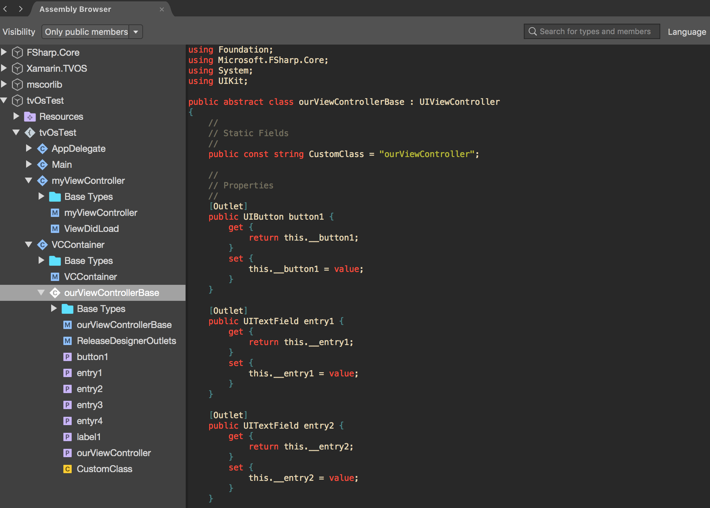
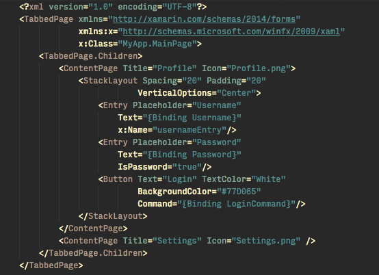
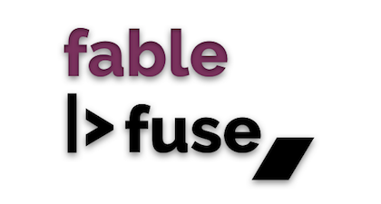
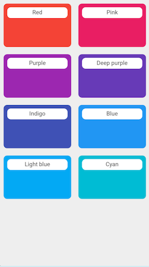
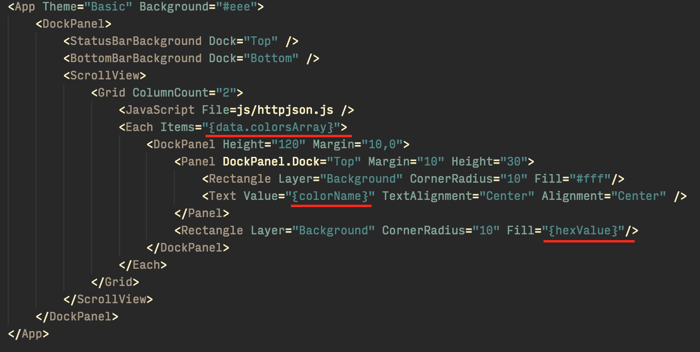
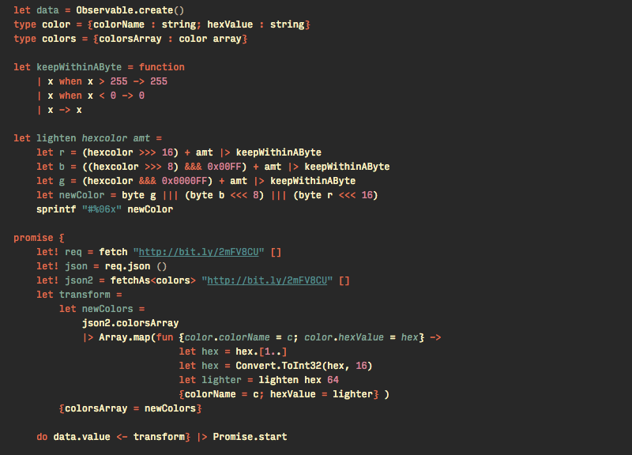

- title : FsReveal
- description : The expanding horizons of F# mobile development
- author : Dave Thomas
- theme : sky  
- transition : default
- width: "100%"

***

##The expanding horizons of F# mobile development

 

Dave Thomas

[@7sharp9_exhumed](https://twitter.com/7sharp9_exhumed)

[7sharpnine.com](http://7sharpnine.com/)

[Twitch](https://www.twitch.tv/7sharpnine)

 #fsharpX | #fsharp

' GIS
' Command and control
' Mobile
' Finance
' Compiler and tools hacker
' Xamarin Hacker
' EPOS

***
##What are my options?

***

#Xamarin

---

##Xamarin native

* Xamarin iOS
* Xamarin Android

  

##Xamarin Forms

* Cross platform
* shared UI
* Aimed at simple user interfaces

***

##Xamarin iOS

- 100% API coverage
- Interface builder

  

##Platforms

- iPhone
- Watch OS
- TvOs
- Mac

---

##iOS Example

	[code=fsharp]
    [<Register ("myViewController")>]
    type ViewController (handle:IntPtr) =
        inherit UIViewController (handle)

        [<Outlet>]
        member val myButton = Unchecked.defaultof<UIButton> with get, set

        override x.ViewDidLoad() =
            x.myButton.TouchUpInside.Add
                (fun _ -> x.View.BackgroundColor <- UIColor.Red)

---

##iOS Example

---

##Is there a better way to do this?

---

# Yes!

---

###Introducing The iOS designer provider

* Generative type provider approach
* _code behind_ that is actually behind the scenes
* Outlets are exposed for use and not stringly typed
* Code completion and tooltips available
* Code is injected into the final assembly
* No clutter
* Less code

' Generated code based on storyboards found in the scene
' 
' Outlets generated based on custom name

---

###Example

---

##Example

	[lang=fsharp]
    type VCContainer = Xamarin.UIProvider

    [<Register(VCContainer.ourViewControllerBase.CustomClass)>]
    type myViewController(ptr) =
        inherit VCContainer.ourViewControllerBase(ptr)

---

###Generated Code

***

##Xamarin Android

- 100% API coverage
- Interface builder

  

###Platforms

* Android Phone
* Android Wear

***

##Xamarin Forms

>Build native UI's for iOS, Android and Windows phone from a single, shared codebase 

* Cross platform
* shared UI
* Aimed at simple user interfaces
* Create user interface in Xaml or programatically

---

##Xamarin Forms Example

---

###Xamarin Forms Programmatic Example

    [lang=fsharp]
    let profilePage = 
        ContentPage(
            Title="Profile",
            Icon="Profile.png",
            Content=StackLayout.Create(
                [ Entry (Placeholder="Username") 
                  Entry (Placeholder="Password", IsPassword=true)
                  Button (Text="Login",
                          TextColor=Color.White, 
                          BackgroundColor=Color.FromHex "77D065") ], 
                  spacing=20.0,
                  padding=thickness 50.0,
                  verticalOptions=LayoutOptions.Center))
                        
    let settingsPage = ContentPage(Title="Settings", Icon="Settings.png")
    let mainPage = TabbedPage.create [profilePage;settingsPage]
	type App() =
        inherit Application(MainPage = mainPage)

---

###Xamarin Forms Xaml Example

---

###Xamarin Forms Code Behind Example

	[lang=fsharp]
    type MainPage() as self =
	    inherit ContentPage()
        do base.LoadFromXaml(typeof<MainPage>) |> ignore
        let usernameEntry = base.FindByName<Entry>("usernameEntry")

    type App() = 
        inherit Application(MainPage = MainPage())

***

##So how do I choose?

---

##Use Xamarin Forms when...

   

* UI is relatively simple
* Requires little platform specific functionality
* Code sharing is more important than UI
* Comfortable with XAML or programmatic construction

---

##Use Xamarin Native when...

 

* A complex UI is required
* Interactions require native behavior
* You want to use many platform-specific API's or features
* The UI is more important than code sharing

***

##Fable

####What is Fable?

 

* Fable compiles F# to JavaScript
* Combines the power of F# with the pervasiveness of JavaScript
* Allows an opportunity to use the expressiveness and power of F# on new platforms
* Integrates with Existing JavaScript libraries
* Support most of Fsharp.Core and a some of the BCL
* Allows dynamic programming for fast turn around
* Can provide strongly typed foreign interfaces

***

---

## What is Fable |> Fuse?

 

>Fuse is a set of tools that makes designing and developing native mobile apps fast, easy and fun

 

* Fable generates JavaScript from F#
* User interface designed in an Xml dialect called UX
* Business logic defined in reactive JavaScript
* Code is compiled natively via C++

--- 

## Fable |> Fuse Example

---

### UX markup

---

### JavaScript

	[lang=js]
	var Observable = require("FuseJS/Observable");

	var data = Observable();

	fetch('http://bit.ly/2mFV8CU')
		.then(function(response) { return response.json(); })
		.then(function(responseObject) { data.value = responseObject; });

	module.exports = {
		data: data
	};

---

###Json based data

    [lang=json]
	{
		"colorsArray":[{
				"colorName":"Red",
				"hexValue":"#F44336"
			},
			{
				"colorName":"Pink",
				"hexValue":"#E91E63"
			},
			{
				"colorName":"Purple",
				"hexValue":"#9C27B0"
			}, ...
		]
	}

---

### F#

    [lang=fsharp]
    open Fable.Core
    open Fuse
    open Fable.PowerPack
    open Fable.PowerPack.Fetch

    let data = Observable.create()
    let result =
	    promise {
	        let! req = fetch "http://bit.ly/2mFV8CU" []
	        let! json = req.json ()
	        do data.value <- json} |> Promise.iter ignore

---

### F# more elaborate

' Adding strong types
' Adding functions

---

##Fable |> Fuse

######Pros

* Hot reloading
* Declarative UI
* x-plat

---

##Fable |> Fuse

######Cons

* Bleeding edge
* Limited by the Fuse framework and UX markup
* Coverage not 100% for those parts native code required (Obj-C/Swift/Java.)
* Packaging with webpack can be perilous (here be dragons)

' Support: Although considerable from Fuse and community, compiling of F# to JavaScript might present unforeseen issues.
' 
' Expect problems, be prepared to roll your sleeves up.

***

##Fable +  React Native

 

>React Native lets you build mobile apps using JavaScript.
>It uses the same API as React, lets you compose a mobile UI from declarative components

---
##Example

	[lang=fsharp]
	open Fable.Core
	open Fable.Import
	module R = Fable.Helpers.React
	module RN = Fable.Import.ReactNative
	open RN.Props
	
	let button =
	    text [] "click me!"
        |> touchableHighlight [
	        OnPress (fun () -> console.log("clicked!"))]
			
	let image =
	    image 
	    [ Source [ Uri "http://facebook.github.io/react/img/logo_og.png"
	               IsStatic true ]]      
	    []
	
	view [] 
	    [ image
	      button ]

' Similar to vdom in elm
' 
' Fable Elmish

---

##Fable + React Native

######Pros

* Hot reloading
* Declarative UI
* x-plat

---

##Fable + React Native

######Cons

* Bleeding edge
* JavaScript oriented logic, efficiency, threading
* Limited by the react framework
* Run time only type checking
* Tricky debugging Chrome / (gdb, lldb)
* API coverage not 100%
* Packaging with webpack can be perilous (here be dragons)

' For those parts where native code required, cross language interaction between F# -> JS -> Swift/Java.
' 
' Run time only type checking: Obviated slightly by Fable although dynamic programming often used in Fable.  
' 
' Support: Although considerable from react community, compiling of F# to JavaScript might present unforeseen issues.
' 
' Expect problems, be prepared to roll your sleeves up.

---

###How are Fuse and React Native different?

* Fuse aimed at designers and developers
* Fuse has an OpenGL based UI, intuitive and slick user experience
* Fuse has real-time editing of UX markup, real-time updating of UX code from Inspector
* React Native hosts more code in JavaScript like UI manipulation, virtual dom and serialization
* React Native has a lot more components available for initial use 

***

##Bringing it all together

##Xamarin  

* 100% Native API coverage  
* Well supported platform  
* x-platform option available with Xamarin Forms
* Compiles to native code
* Same day availability for new API's
* Easier debugging

---

##Bringing it all together

##Fable

* Hot coding on Fuse and React Native
* API coverage is not yet 100%
* Bleeding edge, be prepared to go deep
* Dependent on JavaScript compilation from F#  
* Support may vary

***

##Colophon Xamarin

[Xamarin iOS](https://www.xamarin.com/platform#ios)

[Xamarin Android](https://www.xamarin.com/platform#android)

[Xamarin Forms](https://www.xamarin.com/forms)

* Look out for blog post on iOS designer provider

---

##Colophon Fable 

[Fable](http://fable.io/)

[React Native](https://facebook.github.io/react-native/)

[Fuse](https://www.fusetools.com/)

[Fable |> fuse](http://7sharpnine.com/2016/06/03/light-the-fuse/)

[Fable React Native](https://github.com/fable-compiler/fable-react_native-demo)

[webpack](https://webpack.github.io/)

***

- data-background-image : ./images/bomb.png
- data-background-repeat : repeat-x
- data-background-size : 128px

##G͕̬AME͇͖̘̟̞̱ O͖̹̪V̥E̝R̦̘̝̝̻̜ 

       

[@7sharp9_exhumed](https://twitter.com/7sharp9_exhumed) 

[7sharpnine.com](http://7sharpnine.com/)

[Twitch](https://www.twitch.tv/7sharpnine)

 #fsharpX | #fsharp
